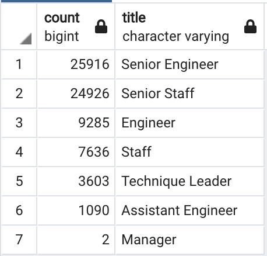
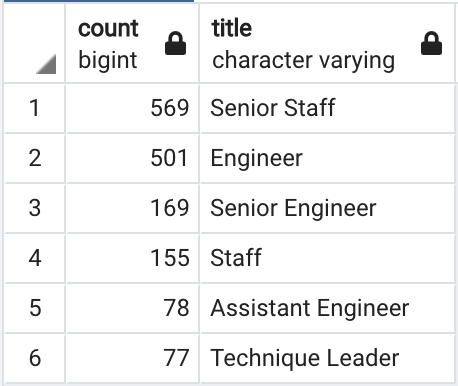

# Pewlett Hackard Employee Database with SQL

## Project Overview

There are two primary objectives in this analysis. The first is to determine the number of employees per title who are close to retirement. The second objective is to determine current employees who would be eligible for a mentorship program in order to alleviate the impending "silver tsunami."

## Resources

- Data Source(s): departments.csv, dept_emp.csv, dept_manager.csv, employee_info.csv, employees.csv, titles.csv
- Software: pgAdmin 4 version 6.7
- Output: retirement_titles.csv, unique_titles.csv, retiring_titles.csv, mentorship_eligibility.csv

## Results

1. Within the first analysis deliverable, it was shown that a considerable amount of senior-level employees would be retiring soon. 25,916 Senior Engineers, 24,926 Senior Staff, 3,603 Technique Leaders, 2 Managers, and many more would be retiring soon. See below for full list.

  
  
2. A total of 72,458 employees will be retring soon.
3. A total of 1,549 employees are eligible for mentorship
4. There are no current managers eligible for the mentorship program. See below for the data.

  

## Summary

- How many roles will need to be filled as the "silver tsunami" begins to make an impact?
  - A total of 72,458 employees are retiring soon, so a comparable amount will be needed to replace those leaving.
- Are there enough qualified, retirement-ready employees in the departments to mentor the next generation of Pewlett Hackard employees?
  - There are not. There are a total of 1,549 employees eligible for the mentorship program, none of which are managers.
  - The longest tenured employees eligible for the mentorship have been with Pewlet Hackard since 1985, while the youngest eligible employees have been with the company since 2002. See below for the script used to find this data. See below for the scripts used to find these data points.
  ```sql
  SELECT COUNT(me.title), me.title
  FROM mentorship_eligible AS me
  GROUP BY me.title
  ORDER BY COUNT(me.title) DESC;
  ```

  ```sql
  SELECT COUNT(me.from_date), me.from_date
  FROM mentorship_eligible AS me
  GROUP BY me.from_date
  ORDER BY me.from_date ASC;
  ```
